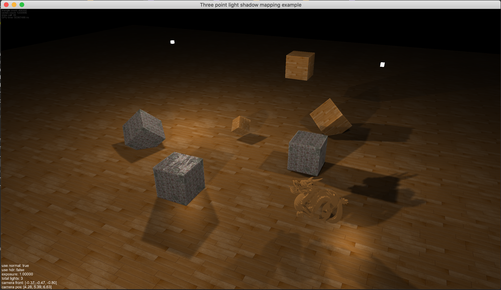

### MacOs OpenGL bootstrap



before to build

```bash
brew install glfw3
brew link glfw
```

```bash
brew install glew
brew link glew
```

```bash
brew install glm
brew link glm
```

### linux-deb bootstrap

before to build

```bash
sudo apt-get install libx11-dev mesa-common-dev libglu1-mesa-dev libglm-dev libglfw3-dev libglew-dev libfreetype6-dev
```

### windows

NOT WORK

### dependencies

- CoreVideo
- Cocoa
- IOkit
- OpenGL
- glew
- glfw
- glm

### TODO

- multiple directional light shadow
- multiple spot light shadow
- CSM (cascade shadow map)
- PSSM (parallel-split shadow map)
- SSAO (screen space ambient occlusion
- deferred rendering
- parallex occlusion mapping
